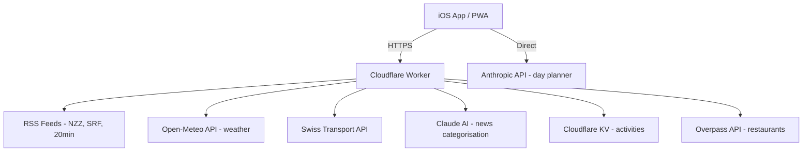
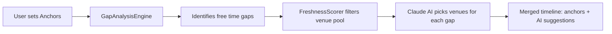

# Znüni Codebase Walkthrough

## What This Project Is

**Znüni** ("Today in Switzerland") is a **family day-planner app for Zürich families with toddlers (ages 2–5)**. It exists across three platforms:

| Platform | Stack | Location |
|----------|-------|----------|
| **PWA** (web) | Single HTML + CSS + JS (~2800 lines) | `frontend/` |
| **iOS app** | SwiftUI, iOS 17+, 128 Swift files | `ios-app/SwissPortal/` |
| **Backend API** | Cloudflare Worker (12 JS modules) | `worker/src/` |

### App Screenshots

The Znuni design system uses a warm editorial aesthetic: **Playfair Display** serif headings, **navy (#1A3A5C)** as the brand accent, **cream (#F5F0E8)** backgrounds, and **terracotta (#C4623A)** warm accents.

---

## Architecture

**Key principle:** The Cloudflare Worker handles all data aggregation (RSS parsing, weather, transport). The iOS app is a presentation layer that also calls Claude directly for the AI day-planner feature.

---

## Backend — Worker Modules (`worker/src/`)

| Module | Purpose |
|--------|---------|
| [index.js](file:///Users/bq/Documents/Znuni/worker/src/index.js) | Router, CORS, entry point |
| [data.js](file:///Users/bq/Documents/Znuni/worker/src/data.js) | Cities config, holidays, school holidays, history facts |
| [news.js](file:///Users/bq/Documents/Znuni/worker/src/news.js) | RSS parsing + Claude AI categorisation |
| [weather.js](file:///Users/bq/Documents/Znuni/worker/src/weather.js) | Open-Meteo integration |
| [transport.js](file:///Users/bq/Documents/Znuni/worker/src/transport.js) | Swiss Transport API (train delays) |
| [activities.js](file:///Users/bq/Documents/Znuni/worker/src/activities.js) | Curated family activities database (~47KB) |
| [events.js](file:///Users/bq/Documents/Znuni/worker/src/events.js) | ~70 hardcoded 2026 city festivals/events |
| [weekend.js](file:///Users/bq/Documents/Znuni/worker/src/weekend.js) | Weekend planner logic |
| [lunch.js](file:///Users/bq/Documents/Znuni/worker/src/lunch.js) | Overpass API restaurants |
| [sunshine.js](file:///Users/bq/Documents/Znuni/worker/src/sunshine.js) | Weekend sunshine forecasts for 29 destinations |
| [snow.js](file:///Users/bq/Documents/Znuni/worker/src/snow.js) | Weekly snowfall for 22 ski resorts |
| [donate.js](file:///Users/bq/Documents/Znuni/worker/src/donate.js) | Donation link handler |

**API routes:** `GET /`, `/activities`, `/weekend`, `/lunch`, `/sunshine`, `/snow`, `/donate`, `/version`

---

## iOS App Structure (128 Swift files)

### App Layer
- `AppState.swift` — Global state (city, language, theme, saved data)
- `ContentView.swift` — Tab bar: **Today**, Activities, Explore, Weekend, Settings
- `TodayInSwitzerlandApp.swift` — Entry point

### Core Services
- `APIClient.swift` — Networking to Worker API + R2 photo URLs
- `CacheManager.swift` — Disk cache with per-endpoint TTLs
- `LocationManager.swift` — On-demand geolocation
- `AgendaComposer.swift` — **Claude AI call** for day planning (direct from iOS)
- `GapAnalysisEngine.swift` — Deterministic gap analysis (no AI needed)
- `FreshnessScorer.swift` — Venue scoring: freshness × weather × seasonal × variety
- `AnchorStore.swift` — User's fixed commitments (anchors)
- `CalendarService.swift` — EventKit integration

### The Day Planner System (Today Tab)

This is the core feature — an **AI-powered full-day planner** for families:

**How it works:**
1. User adds **anchors** — fixed commitments (birthday party, doctor appointment)
2. `GapAnalysisEngine` splits the day (8am–9pm) around anchors into free gaps
3. Each gap gets classified: `morningActivity`, `lunch`, `afternoonActivity`, `dinner`, `quickActivity`
4. `FreshnessScorer` pre-filters venues (excludes recently visited, seasonal mismatches, feed-only)
5. `AgendaComposer` sends the scored pool + gaps to Claude AI → Claude picks the best venue per gap
6. Anchors + AI slots merge into a unified `DayAgenda` timeline

---

## Implementation Status — All 17 Steps Done

Per [znuni-implementation-status-v6.md](file:///Users/bq/Documents/Znuni/design%20system/znuni-implementation-status-v6.md):

| Steps 1–10 | Steps 11–17 |
|-------------|-------------|
| ✅ Worker schema additions | ⏸ KV sync (deferred) |
| ✅ Swift data models | ✅ Polish |
| ✅ GapAnalysisEngine + 8 tests | ✅ Execution mode |
| ✅ FreshnessScorer + 9 tests | ✅ Custom slots + editing |
| ✅ Template engine fallback | ✅ Check-in, timeline shift, notifications |
| ✅ Today screen shell | ✅ Multi-day planning |
| ✅ AnchorFormSheet (5-step) | ✅ Calendar → anchor flow |
| ✅ Agenda UI components | |
| ✅ API integration | |
| ✅ Visit tracking (local) | |

---

## Known Open Issues

1. **Lunch/dinner slots not appearing** — likely root cause: `openForDinner` is nil on most restaurants in `lunch.js` data
2. **Data quality gaps** — `suggestibility`, `kidFriendly`, `availableMonths` fields are sparse across activities/restaurants
3. **planCompletion visit recording** — not verified as wired
4. **Notification scheduling** — not audited

---

## Existing Design Specs (Ready but Not Built)

### Calendar Sync — ✅ Built
- **Read:** EventKit events → Tinder-style swipe to accept/discard → accepted become anchors
- **Write:** Export plan to iOS Calendar, auto-update on slot swap
- Spec: [znuni-calendar-sync-spec.md](file:///Users/bq/Documents/Znuni/design%20system/znuni-calendar-sync-spec.md)

---

## Where We Are → "Family Calendar Day Planner"

The day planner is **functionally complete** — all 17 build steps + Calendar Sync done. What remains:

- **Bug fix:** Lunch/dinner slots not appearing (data issue)
- **Data enrichment:** Populating missing fields on venues
- **KV sync:** Deferred until multi-user
- **App Store prep:** Icon, screenshots, privacy policy
